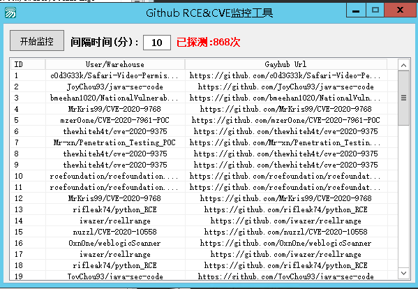
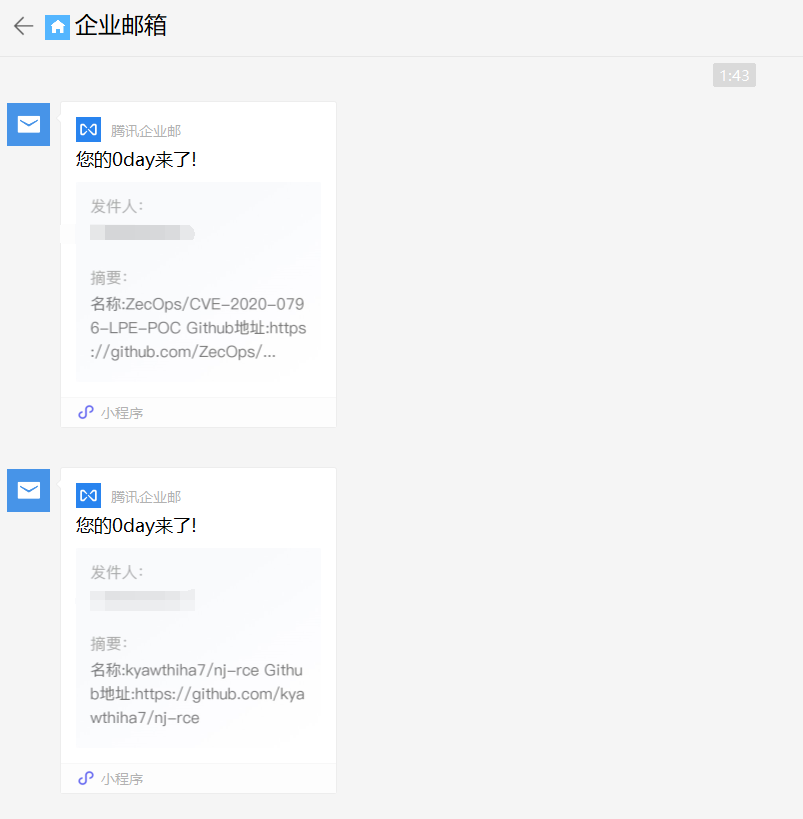

# Github-Monitor

**有时候，新出了CVE或者RCE，但你完全不知道，这款Github监控器就能帮助你第一时间获取漏洞详情,和漏洞EXP/POC,并且发送到你的邮箱中.**

**监控器使用Python + E 编写,兼有两种语言的优点**

**免去了往常的Github监控系统繁杂的搭建操作,只需要一个Windows服务器,安装Python3,和Requests模块,即可运行.**

**有人反馈问题,注意以下几点:**

**1.确保你的电脑中有Python3,并安装了Requests模块**

**2.之前下的重新下一次，忘记放了两个txt文件**

**更新:2020.4.7 10:23**

